# Formation Angular : Avancé

## Description de la formation
La formation Angular 4 : Les fondamentaux vous a permis de comprendre le fonctionnement d’Angular 4. Dans cette nouvelle formation vous allez approfondir des notions que vous avez déjà abordées mais vous allez aussi découvrir des concepts plus avancés sous Angular 4.

Durant formation Angular 4 vous allez découvrir le concept de Zone qui va vous obliger à mieux comprendre le principe de fonctionnement de JavaScript. La découverte des Zones est une introduction au fonctionnement bas niveau d’Angular 4 puisque nous allons voir la façon dont il gère le changement dans l’arbre DOM et comment nous pouvons optimiser ce comportement.

Le travail avec les formulaires est essentiel, pendant cette formation Angular 4 vous comprendrez que les ReactiveForms vont vous permettre d’être plus efficace en concevant la totalité du formulaire dans le code de votre component (et pas dans le template comme c’est le cas avec le template-drive-forms).

Aussi, cette formation Angular 4 vous permettra de maitriser l’injection de dépendance, qui est un principe fondamental présent dans la plupart des frameworks. Comme dans AngularJS, Angular 4 propose la notion de service qui va vous permettre d’injecter votre « business logic » dans vos components. Vous allez voir comment fonctionne l’injection de dépendance et comment développer un service.

Avec les Pipes dans cette formation Angular 4, vous allez voir comment maitriser l’affichage de certaines datas dans vos templates. Vous découvrirez une liste des principaux Pipes et verrez comment développer le vôtre.

Les routes représentent la colonne vertébrale d’une application web. Durant cette formation Angular 4 vous allez voir comment gérer les routes enfants et les routes secondaires (en utilisant les chemins relatifs) et vous verrez également comment contrôler l’accès aux routes avec les Guards. En dernier lieu, vous découvrirez comment charger des datas « au bon moment » (lazy loading).

Dans le projet final de la formation vous verrez comment utiliser Docker pour mettre en place très rapidement un serveur Restful et vous implémenterez les principaux concepts abordés dans les vidéos.

Cette formation Angular 4 est très orientée pratique et démonstration. Elle est construite autour d’un projet que vous allez réaliser au fur et à mesure que le formateur. Tous les exercices, les sources et les fichiers sont en téléchargement depuis votre espace membre.
## Objectifs
* Utiliser Docker du point de vue du développeur Angular 4 
* Développer des formulaires dans le code des components avec les ReactiveForms sous Angular 4 
* Comprendre l’injection de dépendance et développer des services Angular 4 
* Utiliser et développer des Pipes avec Angular 4 
* Maîtriser le routing de l’Angular 4  (child, routes secondaires et guards)
## Notion aborbée
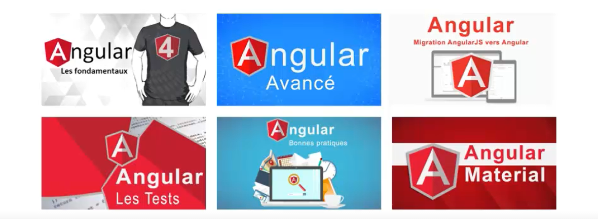

## Plan du cours
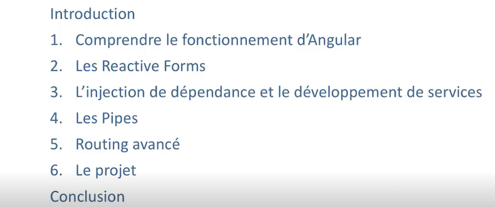
## Plan
* Les Reactives forms
* Reactive forms vs Template Driven forms
* Démostration
## Les Reactives forms
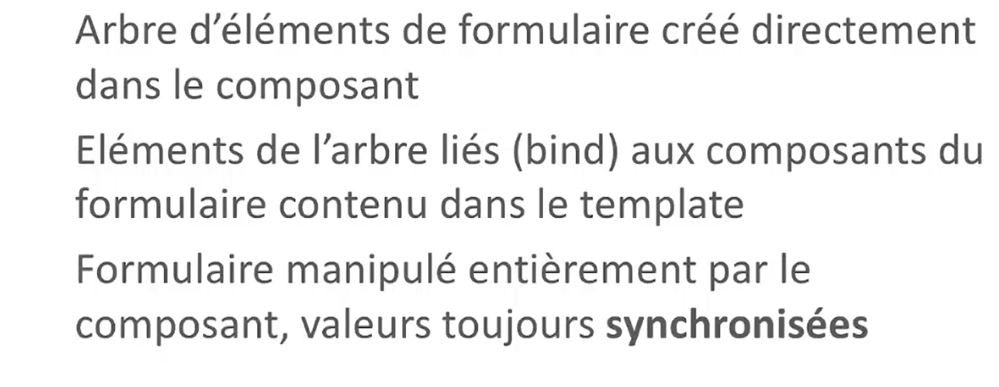
## Comparaison
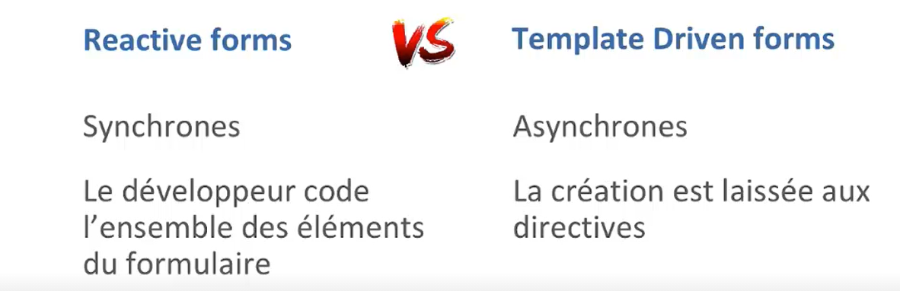
## Schema
### Template driven forms
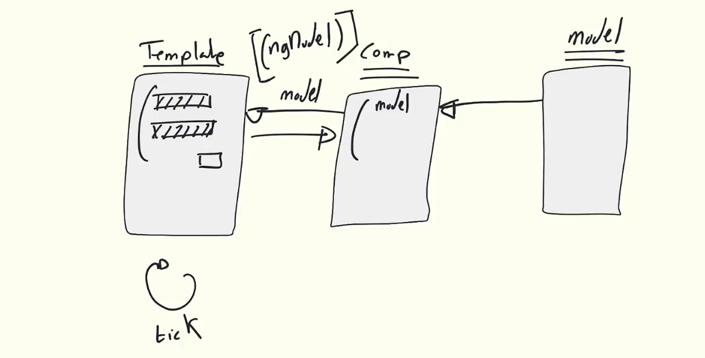

### Reactive driven forms
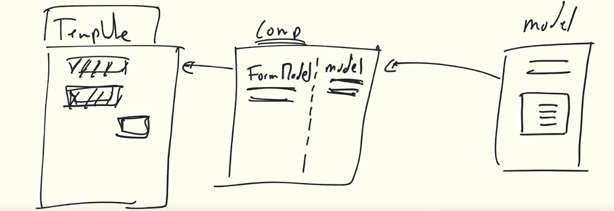
## FormBuilder
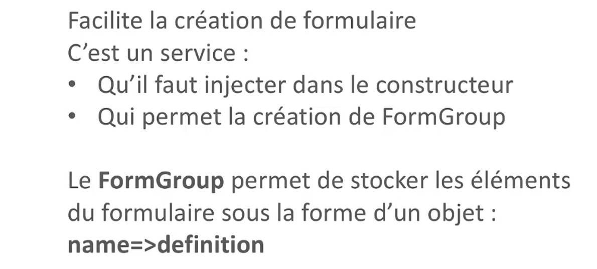
## La validation
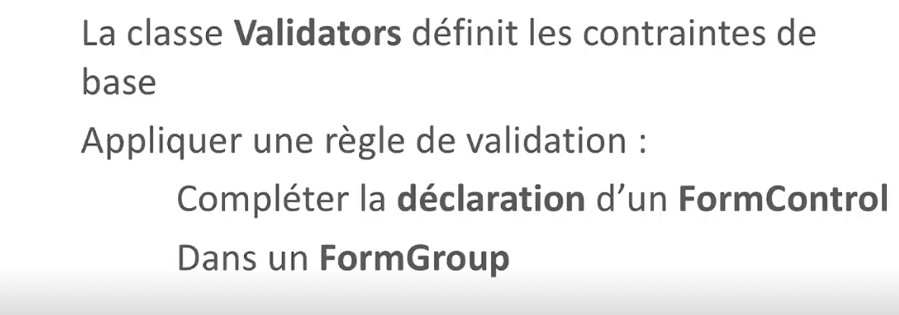
## L'Injection de deépendance ?
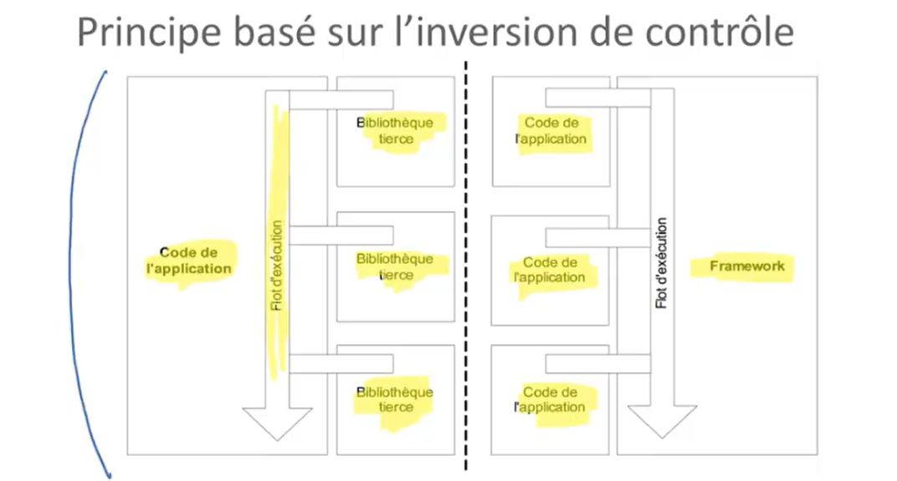
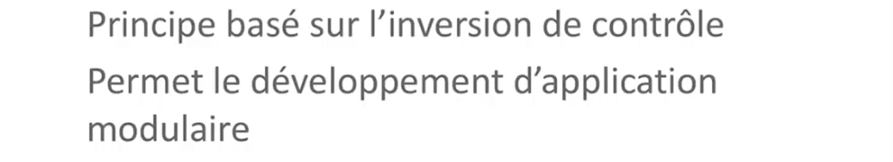
## Le principe de l'injection de dependance
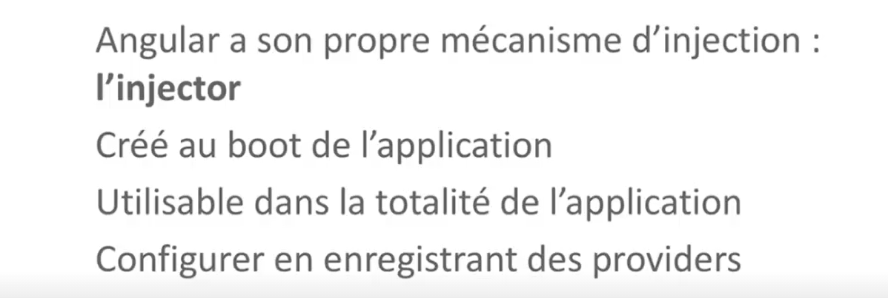
## Services
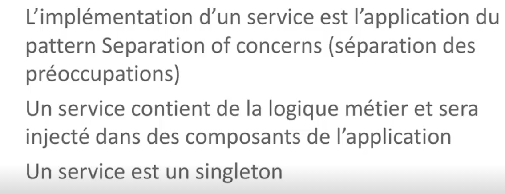
## Création de service
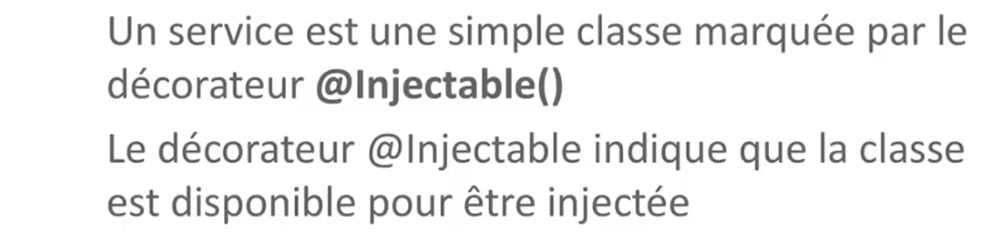
## Pipe
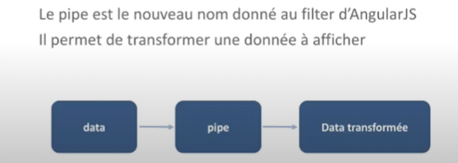
## Utilisation du pipe
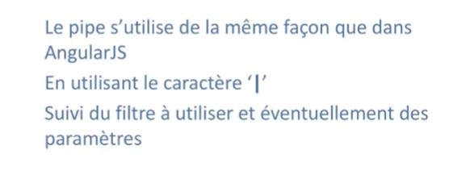
## Pipe personaliser
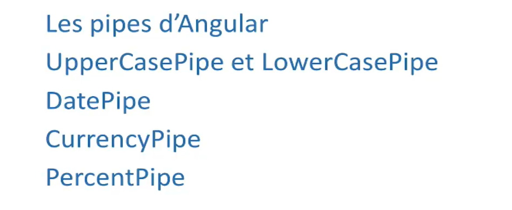
## UperCase et LowerCase
### UperCase
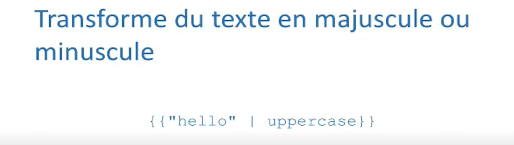
### LowerCase

## DatePipe
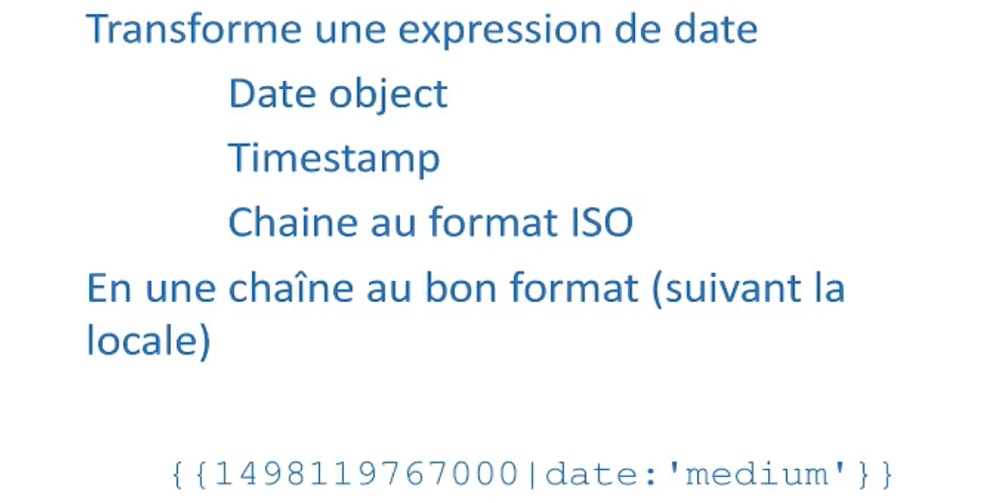
## CurrencyPipe
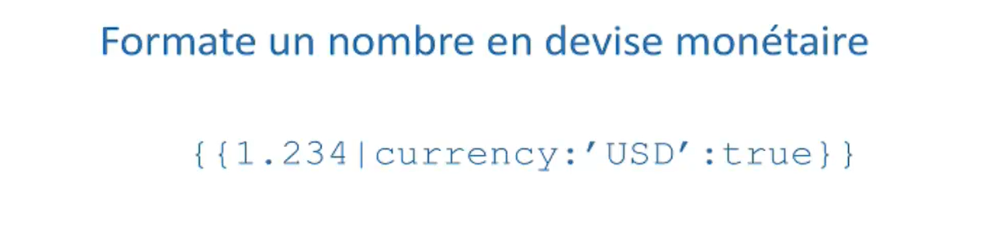
## PourcentPipe
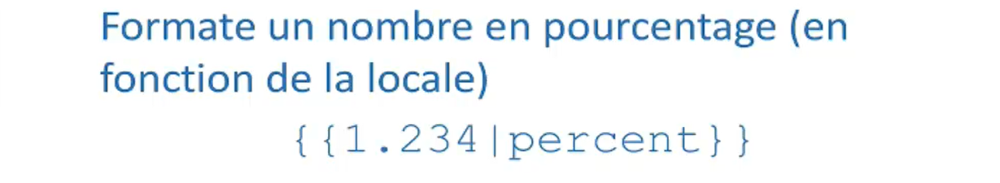
## Autre Pipe Personalisée
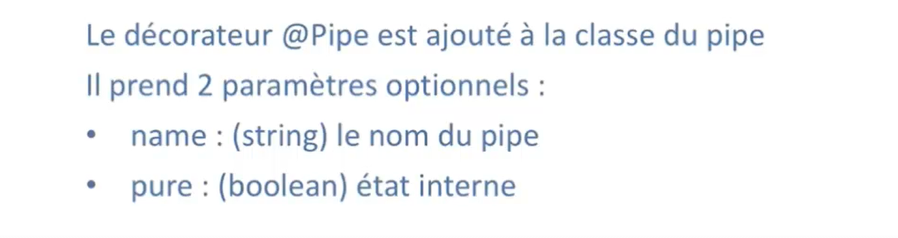

## Interface PipeTransformer
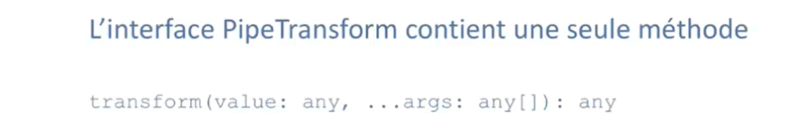
## Route en Angular
## Module en angular
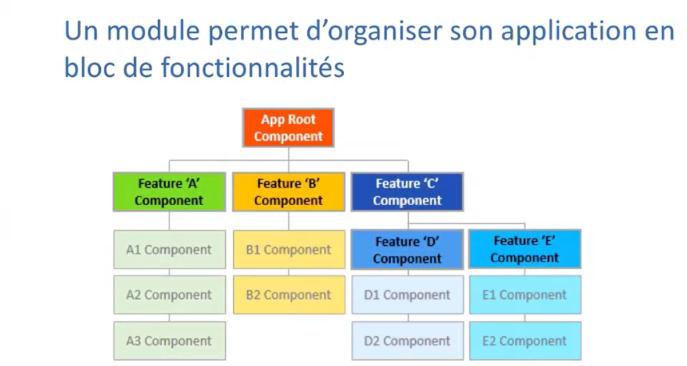
### Configuration
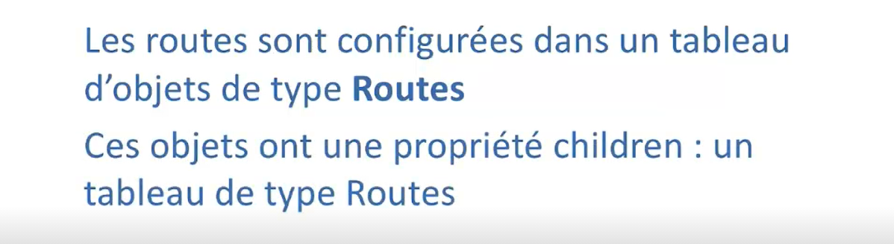
### Application à réaliser ici
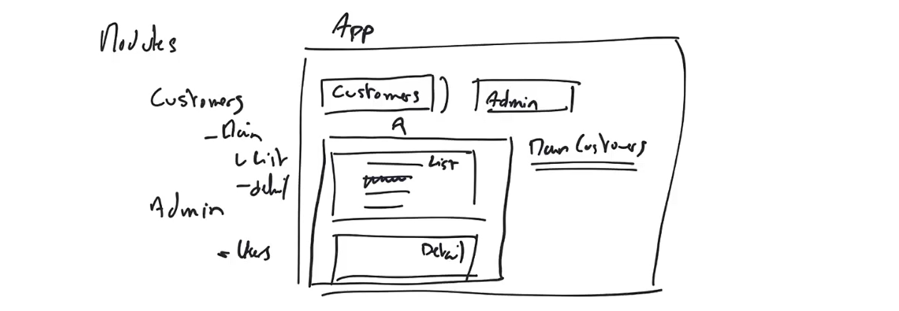